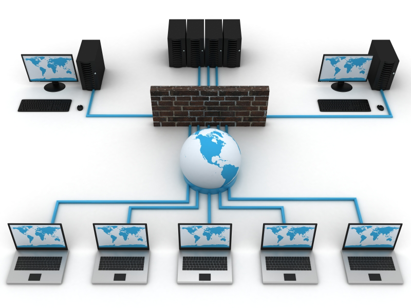
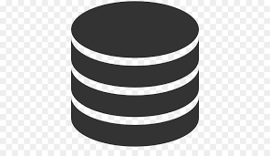

# Coding 101

## Types of Coding

### Design

#### Description of Design Coding

Designers are in charge of the entire user experience of the application that they are building. This includes visuals such as user interfaces, graphics and fonts. In addition, designers are tasked with creating the best experience for a user to move through effectively.

#### Popular Design Languages and Frameworks

- HTML
- CSS
- Sass
- LESS

***

### Front-End

#### Description of Front-End Coding

Works directly with designers and implements the code that makes the user's experience "work". Often Front-End and design is combined into the same role.

#### Popular Front-End Languages and Frameworks

- Javascript
- Angular
- jquery

***

### Back-End

#### Description of Back-End Coding

Back-end coding deals with interpreting the requests coming from the front-end systems and converting them into the business logic to integrate into the system as a whole.

#### Popular Back-End Languages and Frameworks

- Node
- Python
- Java
- C#
- PHP
- Ruby

***

### System & Networking

#### Description System & Networking Coding

Networking and systems coding deals with how computers on networks communicate, along with firewalls, and security rules. In addition, system infastructure and enterprise computer setup will entail these practices.

#### Popular Systems and Networking Languages and Frameworks

- C
- C++
- Unix

***

### Database & Big Data

#### Description of Database Coding

There are 2 major classifications of database coding. The first deals with relational data-systems (SQL Databases). The second is coding that deals with flat and non-relational (NoSQL) databases.

#### Popular Database Languages and Frameworks

- SQL
- Python
- R
- Scala
- Spark

***

### Mobile

#### Description of Mobile Coding

This is the coding required to create a mobile App. There are the traditional ways of creating these apps using native programming, and there are newer options built to try to minimize the amount of re-work across platforms. These newer systems ussually come at a cost of performance.

#### Popular Mobile Languages and Frameworks

- Objective C (iPhone)
- Swift (iPhone)
- Java (Android)
- React Native

***

From <https://www.reddit.com/r/learnprogramming/wiki/faq>

|I want to learn how to...|Consider using...|
|----|----|
|...make iPhone Apps|Swift|
|...make Android Apps|Java|
|...build a website|JavaScript, CSS, HTML5|
|...write Windows desktop applications|C#|
|...make 2D/3D games|JavaScript, C#, or C++|
|...program Arduinos/micro-controllers/robots|C|
|...do scientific/mathematical computing or data analysis|Python, R, or Matlab|
|...do automation and scripting	Many languages|Python, Ruby, Bash, Powershell|

## Python Introduction

### Why are we using Python

- It's quick to get started
- Platform independent
- Less boilerplate code

### Python's Key Features

- Interpreted Language
- Structural or Object Oriented

### Who uses Python

- Google
- Spotify (Native Application & Backend)
- Instagram (Backend)

## Let's Try it out

<https://colab.research.google.com/>

[Result from Class](coding_101.ipynb)

## Continued Learning

### Learning for Technical PM Job

- <https://www.firecode.io/>
- <https://www.hackerrank.com/>

### Learn for your own Project

- <https://hackr.io/>
- <https://bento.io/>
